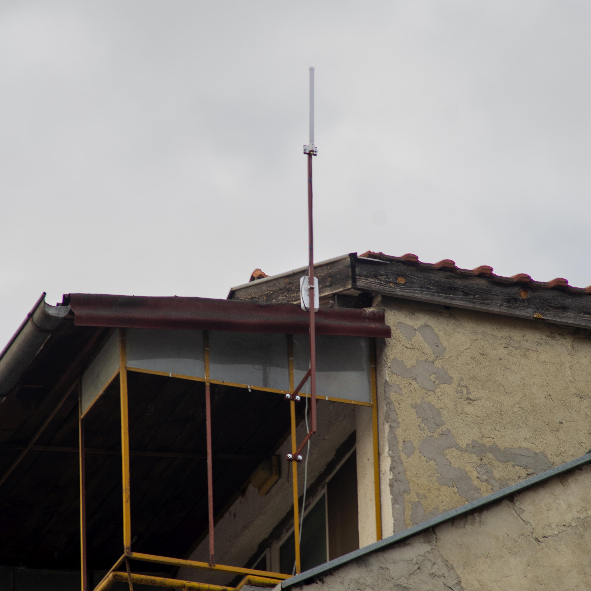
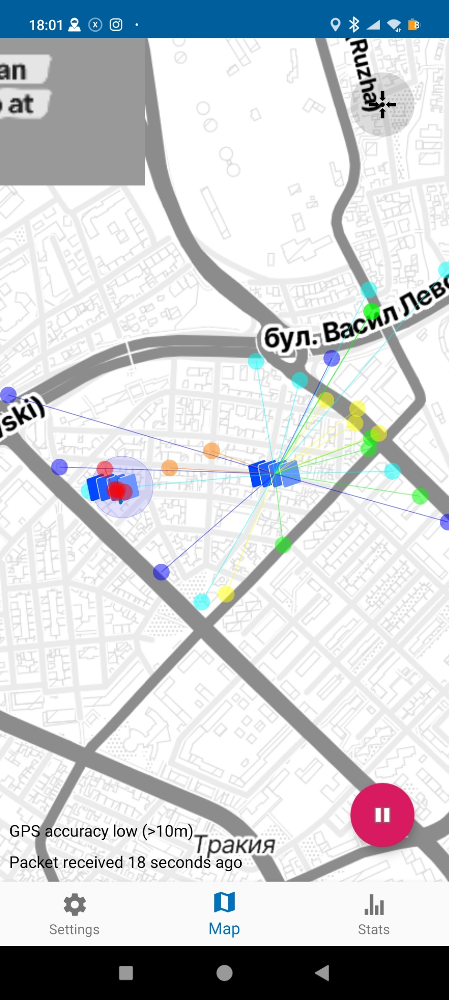

After a somewhat quiet period, we're back with new projects and ideas. We've acquired some new hardware - MikroTik gateways

The first out of ten underwent its shakedown today, and we achieved decent results.

We're super eager to deploy the next ones in the coming weeks, so stay tuned !

VarnaLab team
